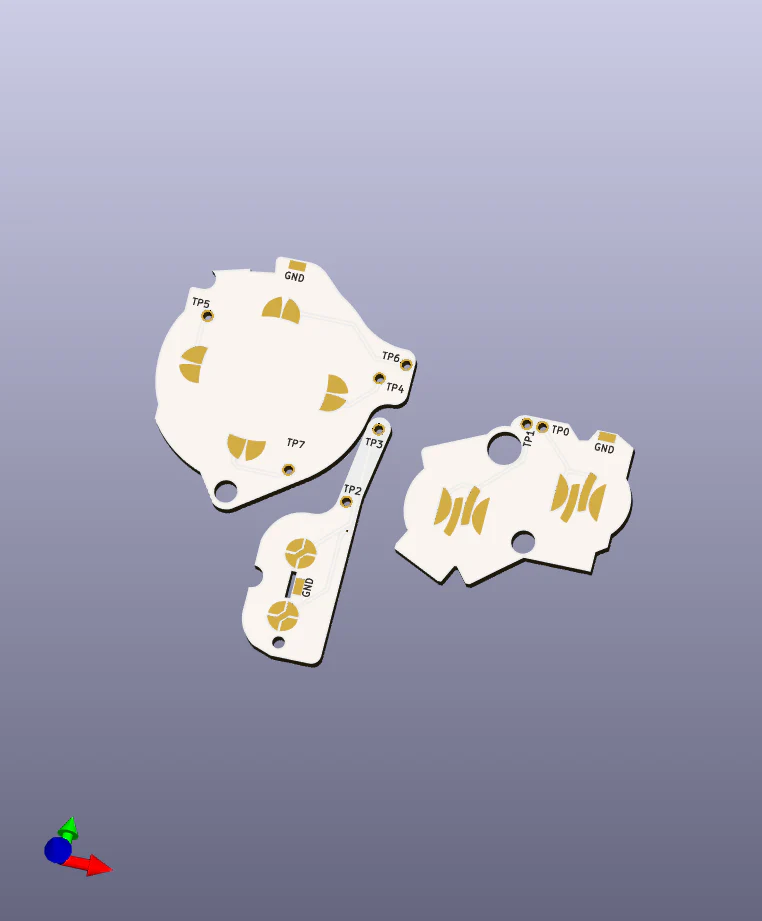

# GBA Button Pad Replacement

Open source replacement PCBs for the Game Boy Advance button contacts. Order as a flex PCB and solder to the test points (or traces if the test points are dead also). [Check out my GBA scans if you need help locating the traces](https://wiki.nataliethenerd.com/gameboy/gameboyadvance#agb-cpu-01)

